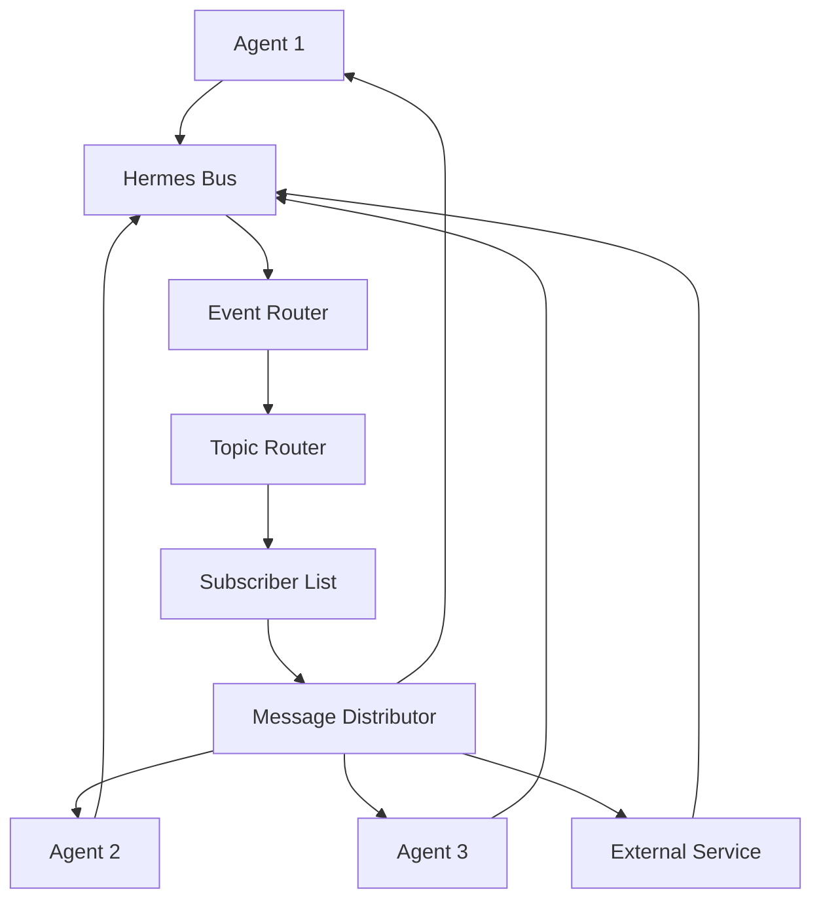

# 🚌 Hermes Communication Bus

## Overview

Hermes is the cross-process messaging architecture that powers inter-agent communication and event distribution in the glayph/agent framework. It provides a reliable, scalable, and secure messaging infrastructure for distributed agent systems.

---

## 🏗️ Architecture Overview

### Core Components

| Component | Purpose | Technology |
|-----------|---------|------------|
| **Message Broker** | Central message routing | Redis / RabbitMQ |
| **Event Emitter** | Event generation | EventEmitter v2 |
| **Event Listener** | Event subscription | WebSocket + HTTP |
| **Protocol Handler** | Message serialization | Protobuf / JSON |
| **Security Layer** | Authentication & encryption | JWT + TLS |

### Communication Flow



---

## 📡 Message Protocol

### Message Structure

```typescript
interface HermesMessage {
  id: string;                    // Unique message ID
  timestamp: number;             // Unix timestamp
  source: string;                // Sender ID
  target: string;                // Recipient ID(s)
  topic: string;                 // Message topic/channel
  type: MessageType;             // Message category
  payload: any;                  // Message content
  metadata: MessageMetadata;     // Additional metadata
  priority: Priority;            // Delivery priority
  ttl: number;                   // Time to live (seconds)
  retries: number;               // Retry count
  headers: Map<string, string>;  // Custom headers
}
```

### Message Types

| Type | Description | Use Case |
|------|-------------|----------|
| **EVENT** | State change notification | Agent state changes |
| **COMMAND** | Action request | Tool execution commands |
| **QUERY** | Information request | Data retrieval requests |
| **RESPONSE** | Command response | Command execution results |
| **BROADCAST** | Public message | System-wide announcements |
| **ACK** | Acknowledgment | Message receipt confirmation |
| **NACK** | Negative acknowledgment | Error notification |

### Event Payload Structure

```typescript
interface EventPayload {
  event: EventType;
  data: any;
  context: EventContext;
  timestamp: number;
  source: string;
  version: string;
}

interface EventContext {
  sessionId: string;
  agentId: string;
  conversationId?: string;
  taskId?: string;
  userId?: string;
  metadata: Record<string, any>;
}
```

---

## 🔌 Pub/Sub Architecture

### Topics and Channels

#### Core Topics
```typescript
const Topics = {
  // Agent lifecycle
  AGENT_STATE_CHANGE: 'agent.state.change',
  AGENT_STARTED: 'agent.started',
  AGENT_STOPPED: 'agent.stopped',
  AGENT_ERROR: 'agent.error',
  
  // Tool execution
  TOOL_EXECUTE: 'tool.execute',
  TOOL_RESULT: 'tool.result',
  TOOL_ERROR: 'tool.error',
  
  // Memory events
  MEMORY_UPDATE: 'memory.update',
  MEMORY_QUERY: 'memory.query',
  MEMORY_SEARCH: 'memory.search',
  
  // Channel events
  CHANNEL_MESSAGE: 'channel.message',
  CHANNEL_CONNECTED: 'channel.connected',
  CHANNEL_DISCONNECTED: 'channel.disconnected',
  
  // System events
  SYSTEM_ALERT: 'system.alert',
  SYSTEM_HEALTH: 'system.health',
  SYSTEM_METRICS: 'system.metrics'
};
```

#### Channel Configuration
```yaml
channels:
  agent_events:
    topic: agent.state.change
    subscribers: ['gateway', 'memory', 'monitoring']
    qos: 'at_least_once'
    persistence: true
    
  tool_execution:
    topic: tool.execute
    subscribers: ['core', 'safety', 'metrics']
    qos: 'at_most_once'
    retention: '24h'
    
  memory_events:
    topic: memory.update
    subscribers: ['cache', 'indexer', 'api']
    qos: 'exactly_once'
    compression: true
```

### Quality of Service (QoS)

| QoS Level | Delivery Guarantee | Use Case |
|-----------|-------------------|----------|
| **AT_MOST_ONCE** | Message delivered at most once | Performance-critical operations |
| **AT_LEAST_ONCE** | Message delivered at least once | Critical operations with deduplication |
| **EXACTLY_ONCE** | Message delivered exactly once | Financial or security operations |

### Message Routing

```typescript
class MessageRouter {
  // Route messages based on topic
  async route(message: HermesMessage): Promise<void>;
  
  // Subscribe to topics
  subscribe(topic: string, callback: MessageHandler): string;
  
  // Unsubscribe from topics
  unsubscribe(subscriptionId: string): void;
  
  // Topic filtering
  filterTopics(message: HermesMessage, subscriptions: string[]): string[];
  
  // Load balancing
  distributeLoad(subscriptions: string[], message: HermesMessage): string[];
}
```

---

## 🔒 Security & Authentication

### Authentication

#### JWT-Based Authentication
```typescript
interface AuthConfig {
  issuer: string;
  audience: string;
  secret: string;
  algorithm: 'HS256' | 'RS256';
  expiration: number;
  refreshTokenExpiration: number;
}

interface AuthToken {
  sub: string;           // Subject (agent ID)
  iat: number;           // Issued at
  exp: number;           // Expires at
  jti: string;          // JWT ID
  scope: string[];      // Permissions
  nbf: number;          // Not before
  iss: string;          // Issuer
  aud: string;          // Audience
}
```

#### Permission System
```typescript
interface Permission {
  resource: string;
  action: 'read' | 'write' | 'execute' | 'delete';
  conditions?: PermissionCondition;
}

interface PermissionCondition {
  timeWindow?: TimeWindow;
  sourceIp?: string[];
  metadata?: Record<string, any>;
}
```

### Encryption

#### Message Encryption
```typescript
interface EncryptionConfig {
  algorithm: 'AES-256-GCM' | 'AES-128-CCM';
  keyRotationInterval: number;
  keyDerivation: 'PBKDF2' | 'Argon2';
  aad?: string;
}

interface EncryptedMessage {
  encryptedPayload: string;
  nonce: string;
  tag: string;
  algorithm: string;
  keyId: string;
}
```

---

## 📊 Monitoring & Observability

### Metrics Collection

#### Message Metrics
```typescript
interface MessageMetrics {
  messagesSent: number;
  messagesReceived: number;
  messagesProcessed: number;
  deliverySuccessRate: number;
  averageDeliveryTime: number;
  errorCount: number;
  retryCount: number;
  queueSize: number;
}
```

#### Latency Monitoring
```typescript
interface LatencyMetrics {
  publishLatency: number;
  subscribeLatency: number;
  processingLatency: number;
  deliveryLatency: number;
}
```

### Health Checks

```typescript
interface HealthCheck {
  name: string;
  status: 'healthy' | 'degraded' | 'unhealthy';
  latency: number;
  uptime: number;
  errorRate: number;
  lastCheck: number;
}

class HermesHealthChecker {
  async checkBrokerHealth(): Promise<HealthCheck>;
  async checkPublisherHealth(): Promise<HealthCheck>;
  async checkConsumerHealth(): Promise<HealthCheck>;
  async checkAuthHealth(): Promise<HealthCheck>;
  generateHealthReport(): HealthReport;
}
```

---

## 🚀 Performance Optimization

### Scaling Strategies

#### Horizontal Scaling
```yaml
scaling:
  minReplicas: 3
  maxReplicas: 10
  targetCPU: 70
  targetMemory: 80
  
  # Auto-scaling rules
  scaleUp:
    intervals: [1m, 5m]
    thresholds: [80, 90]
    factor: 2
    
  scaleDown:
    intervals: [5m, 10m]
    thresholds: [30, 20]
    factor: 0.5
```

#### Load Balancing
```typescript
interface LoadBalancer {
  algorithm: 'round_robin' | 'least_connections' | 'weighted_round_robin';
  healthCheckInterval: number;
  maxRetries: number;
  timeout: number;
}
```

### Persistence

#### Message Persistence
```typescript
interface PersistenceConfig {
  backend: 'redis' | 'postgresql' | 'file';
  retention: RetentionPolicy;
  compression: boolean;
  checkpointInterval: number;
}

interface RetentionPolicy {
  default: '7d';
  critical: '30d';
  audit: '90d';
}
```

---

## 🔧 Implementation

### Core Implementation

```typescript
// hermes-bus.ts
import { EventEmitter } from 'events';
import { Redis } from 'ioredis';
import jwt from 'jsonwebtoken';

class HermesBus extends EventEmitter {
  private publisher: Redis;
  private subscriber: Redis;
  private auth: AuthService;
  private router: MessageRouter;
  
  async publish(message: HermesMessage): Promise<void> {
    // Authentication
    await this.authenticate(message.source);
    
    // Encryption
    const encrypted = await this.encrypt(message.payload);
    
    // Store in Redis
    await this.publisher.setex(
      `msg:${message.id}`,
      message.ttl,
      JSON.stringify(encrypted)
    );
    
    // Publish to topic
    await this.publisher.publish(
      message.topic,
      JSON.stringify(message)
    );
    
    // Emit event locally
    this.emit('message.published', message);
  }
  
  async subscribe(topic: string, callback: MessageHandler): Promise<string> {
    const subscriptionId = generateId();
    
    // Subscribe to Redis channel
    await this.subscriber.subscribe(topic);
    
    // Setup message handler
    this.subscriber.on('message', async (ch, message) => {
      if (ch === topic) {
        const parsed = JSON.parse(message);
        await this.deliver(parsed, callback);
      }
    });
    
    return subscriptionId;
  }
  
  private async deliver(message: HermesMessage, callback: MessageHandler): Promise<void> {
    // Authentication check
    if (!await this.isAuthenticated(message.source)) {
      throw new Error('Authentication failed');
    }
    
    // Process message
    const processed = await this.processMessage(message);
    
    // Retry logic
    for (let attempt = 0; attempt < message.retries; attempt++) {
      try {
        await callback(processed);
        await this.acknowledge(message.id);
        return;
      } catch (error) {
        if (attempt === message.retries - 1) {
          await this.nack(message.id, error);
        }
        await this.delay(attempt * 1000);
      }
    }
  }
}
```

---

## 📚 Integration Examples

### Agent-to-Agent Communication

```typescript
// inter-agent-communication.ts
import { HermesBus } from '@glayph/agent';

class AgentCommunication {
  constructor(private hermes: HermesBus, private agentId: string) {}
  
  async broadcastTask(task: Task): Promise<void> {
    await this.hermes.publish({
      id: generateId(),
      timestamp: Date.now(),
      source: this.agentId,
      target: '*', // Broadcast to all
      topic: 'task.request',
      type: 'COMMAND',
      payload: { task },
      priority: 'high',
      ttl: 300,
      retries: 3
    });
  }
  
  async requestCollaboration(task: Task, agentIds: string[]): Promise<any> {
    const responses = await Promise.all(
      agentIds.map(agentId => 
        this.hermes.publish({
          id: generateId(),
          timestamp: Date.now(),
          source: this.agentId,
          target: agentId,
          topic: 'task.collaboration',
          type: 'QUERY',
          payload: { task },
          priority: 'normal',
          ttl: 60
        })
      )
    );
    
    return responses;
  }
}
```

### Tool Result Broadcasting

```typescript
// tool-result-broadcast.ts
import { HermesBus } from '@glayph/agent';

class ToolResultBroadcaster {
  constructor(private hermes: HermesBus) {}
  
  async broadcastResult(toolName: string, result: any, context: ExecutionContext): Promise<void> {
    await this.hermes.publish({
      id: generateId(),
      timestamp: Date.now(),
      source: 'tool-executor',
      target: '*',
      topic: 'tool.result',
      type: 'EVENT',
      payload: {
        toolName,
        result,
        context,
        executionTime: context.executionTime
      },
      priority: 'low',
      ttl: 3600,
      headers: {
        'x-tool-category': this.getToolCategory(toolName),
        'x-execution-id': context.executionId
      }
    });
  }
  
  private getToolCategory(toolName: string): string {
    const categories = {
      'shell_': 'system',
      'file_': 'filesystem',
      'browser_': 'web',
      'computer_': 'desktop',
      'scrape_': 'data',
      'model_': 'ai'
    };
    
    for (const [prefix, category] of Object.entries(categories)) {
      if (toolName.startsWith(prefix)) {
        return category;
      }
    }
    
    return 'other';
  }
}
```

---

## 📖 References

### Related Components

- **Event System**: `packages/core/src/events/` - Local event handling
- **Message Types**: `packages/core/src/messages/` - Message definitions
- **Authentication**: `packages/core/src/auth/` - Auth service

### API Documentation

- [Hermes API Reference](/api/hermes.md)
- [Event System API](/api/events.md)
- [Message Protocol API](/api/messages.md)

---

## 🚀 Getting Started

### Basic Usage

```typescript
import { HermesBus } from '@glayph/agent';

const hermes = new HermesBus({
  redis: {
    host: process.env.REDIS_HOST || 'localhost',
    port: parseInt(process.env.REDIS_PORT || '6379'),
    password: process.env.REDIS_PASSWORD
  },
  auth: {
    secret: process.env.HERMES_SECRET,
    issuer: 'glayph-agent',
    audience: 'agent-network'
  }
});

// Publish a message
await hermes.publish({
  id: 'msg-123',
  timestamp: Date.now(),
  source: 'agent-core',
  target: 'memory-service',
  topic: 'memory.query',
  type: 'QUERY',
  payload: { query: 'find recent conversations' },
  priority: 'normal'
});

// Subscribe to events
hermes.subscribe('agent.state.change', (message) => {
  console.log('Agent state changed:', message.payload);
});
```

### Configuration

```typescript
const hermesConfig = {
  transport: {
    type: 'redis',
    url: process.env.REDIS_URL || 'redis://localhost:6379',
    options: {
      retryDelay: 1000,
      maxRetriesPerRequest: 5
    }
  },
  security: {
    auth: true,
    encryption: true,
    ssl: process.env.NODE_ENV === 'production'
  },
  observability: {
    metrics: true,
    tracing: true,
    logging: 'structured'
  },
  performance: {
    maxConnections: 100,
    messageQueueSize: 10000,
    workerThreads: 4
  }
};
```

---

Hermes is the backbone of glayph/agent's distributed architecture, providing reliable, secure, and high-performance messaging between agents, tools, and external services. It's essential for building scalable, collaborative, and responsive autonomous agent systems.

---

## 📊 Architecture Summary

| Aspect | Specification | Details |
|--------|---------------|---------|
| **Message Format** | Binary + JSON | Optimized for performance |
| **Reliability** | Exactly-Once | Deduplication & acknowledgment |
| **Scalability** | Horizontal | Auto-scaling support |
| **Security** | End-to-End | Encryption & authentication |
| **Performance** | Sub-millisecond | Redis-based pub/sub |
| **Availability** | 99.9% | High-availability clustering |

---

The Hermes Communication Bus is a critical component that enables the distributed nature of glayph/agent, ensuring reliable communication and coordination across the entire agent ecosystem.

---