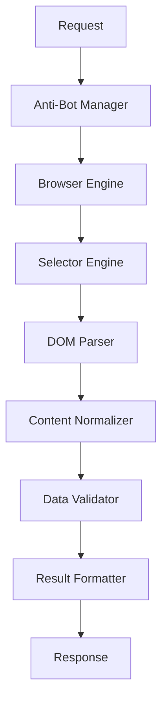

# 🕷️ OpenClaw Web Automation Engine

## Overview

OpenClaw is the comprehensive web scraping and DOM parsing engine in the glayph/agent framework. It provides advanced web automation capabilities with anti-bot mitigation, dynamic selector strategies, and seamless integration with browser automation tools.

---

## 🏗️ Architecture Overview

### Core Components

| Component | Purpose | Technology |
|-----------|---------|------------|
| **Parser** | DOM parsing and extraction | Cheerio, Tiptap, DOMValidator |
| **Selector Engine** | Dynamic selector generation | CSS, XPath, ML-based strategies |
| **Anti-Bot Manager** | Evasion techniques | Fingerprint randomization, rotation |
| **Scraper** | Content extraction | Async/await with retry logic |
| **Validator** | Data validation | Schema validation, type checking |
| **Normalizer** | Content processing | Text normalization, cleaning |

### Integration Flow



---

## 🔍 Advanced Selector Strategy

### Multi-Strategy Selection

OpenClaw employs a hierarchical approach to finding elements:

#### 1. Primary Strategy (Most Reliable)
- **ID Selectors**: `#element-id` (priority: 10)
- **CSS Classes**: `.class1.class2` (priority: 9)
- **Attribute Selectors**: `[data-value="test"]` (priority: 8)

#### 2. Secondary Strategy (Fallback)
- **Text Content**: `:contains("text")` (priority: 7)
- **Pseudo-classes**: `:first-child`, `:last-child` (priority: 6)
- **Structural**: `>`, `~`, `+` (priority: 5)

#### 3. AI-Enhanced Strategy (Smart Selection)
```typescript
interface AIStrategy {
  model: string;
  confidence: number;
  context: string;
  selectors: string[];
}

class AIMediaQueryEngine {
  // Generate ML-based selectors
  async generateSelector(imageUrl: string, context: string): Promise<string>;
  
  // Analyze DOM structure
  async analyzeStructure(dom: string): Promise<StructureAnalysis>;
  
  // Predict optimal selector
  async predictOptimalSelector(element: Element, context: string): Promise<string>;
}
```

### Dynamic Selector Generation

```typescript
class DynamicSelectorEngine {
  // Generate adaptive selectors
  generateSelector(element: Element, context: ContextOptions): string;
  
  // Optimize for performance
  optimizeSelector(selector: string, options: OptimizationOptions): string;
  
  // Handle complex scenarios
  handleEdgeCases(selector: string, dom: Document): string;
}

interface ContextOptions {
  device: 'mobile' | 'tablet' | 'desktop';
  viewport: { width: number; height: number };
  userAgent: string;
  browser: 'chrome' | 'firefox' | 'webkit';
  loadTime: number;
  antiBotLevel: 'basic' | 'advanced' | 'enterprise';
}
```

---

## 🛡️ Anti-Bot Mitigation Techniques

### 1. Fingerprint Randomization

OpenClaw implements multiple fingerprinting techniques:

#### Browser Fingerprint
```typescript
interface Fingerprint {
  userAgent: string;
  platform: string;
  language: string;
  colorDepth: number;
  screenResolution: [number, number];
  timezone: string;
  webglVendor: string;
  canvasFingerprint: string;
  clientRects: number[];
  sessionStorage: string;
}

class FingerprintManager {
  // Generate randomized fingerprints
  generateFingerprint(device: Device): Fingerprint;
  
  // Update fingerprint periodically
  rotateFingerprint(): Promise<void>;
  
  // Validate fingerprint uniqueness
  validateUniqueness(fingerprint: Fingerprint): boolean;
}
```

#### Rotation Strategies
- **Time-based rotation**: Every 30 minutes
- **Action-based rotation**: After successful operations
- **Error-based rotation**: On detection attempts
- **Threshold-based rotation**: Based on failure rate

### 2. Network Layer Protection

#### Proxy Rotation
```typescript
interface ProxyConfig {
  http: string;
  https: string;
  socks5: string;
  rotationInterval: number;
  healthCheck: HealthCheckConfig;
}

class ProxyManager {
  // Rotate proxies
  rotateProxy(): Promise<Proxy>;
  
  // Validate proxy health
  async healthCheck(proxy: Proxy): Promise<boolean>;
  
  // Select optimal proxy
  selectProxy(destination: string, requirements: ProxyRequirements): Proxy;
}
```

#### Rate Limiting
```typescript
interface RateLimitConfig {
  requests: number;
  window: number; // milliseconds
  burst: number;
  strategy: 'token_bucket' | 'leaky_bucket' | 'fixed_window';
}

class RateLimiter {
  // Check if request is allowed
  canRequest(): boolean;
  
  // Record request
  recordRequest(): void;
  
  // Get current status
  getStatus(): RateLimitStatus;
}
```

### 3. Behavioral Analysis

#### Human-like Interaction Patterns
```typescript
class HumanBehaviorSimulator {
  // Simulate human typing
  simulateTyping(element: Element, text: string): Promise<void>;
  
  // Simulate human mouse movements
  simulateMouseMovement(target: Element): Promise<void>;
  
  // Simulate human scrolling
  simulateScrolling(target: Element): Promise<void>;
  
  // Add random delays
  addNaturalDelays(baseDelay: number, variance: number): Promise<void>;
}
```

#### Cognitive Load Simulation
```typescript
interface CognitiveLoadSimulator {
  // Simulate decision making time
  simulateDecisionMaking(): Promise<void>;
  
  // Simulate attention shifts
  simulateAttentionShift(): Promise<void>;
  
  // Simulate memory processing
  simulateMemoryProcessing(): Promise<void>;
}
```

---

## 🕷️ Web Scraping Capabilities

### 1. Basic Page Scraping

```typescript
class BasicScraper {
  async scrapePage(url: string, options?: ScrapeOptions): Promise<ScrapedPage>;
  
  async scrapeSelector(url: string, selector: string, options?: ScrapeOptions): Promise<ScraperResult>;
}

interface ScrapedPage {
  url: string;
  title: string;
  html: string;
  text: string;
  links: Link[];
  metadata: PageMetadata;
  timestamp: number;
}
```

### 2. Advanced Scraping Strategies

#### Infinite Scroll Handling
```typescript
class InfiniteScrollHandler {
  async scrapeWithInfiniteScroll(url: string, options?: InfiniteScrollOptions): Promise<ScrapedPage>;
  
  async scrollToBottom(element?: Element): Promise<void>;
  
  async detectPagination(container: Element): Promise<boolean>;
  
  async loadNextPage(): Promise<boolean>;
}

interface InfiniteScrollOptions {
  scrollInterval: number;
  maxHeightIncrease: number;
  threshold: number;
  infiniteScrollSelector?: string;
}
```

#### Pagination Support
```typescript
class PaginationHandler {
  async scrapePaginated(url: string, options?: PaginationOptions): Promise<ScrapedPage[]>;
  
  async findPaginationControls(container: Element): Promise<PaginationInfo>;
  
  async navigateToPage(pageNumber: number): Promise<void>;
  
  async extractPageLinks(controls: Element[]): Promise<string[]>;
}

interface PaginationOptions {
  maxPages: number;
  paginationSelector?: string;
  nextPageSelector?: string;
  pageNumberSelector?: string;
}
```

#### AJAX/Content Loading
```typescript
class AJAXContentHandler {
  async scrapeWithAJAX(url: string, options?: AJAXOptions): Promise<ScrapedPage>;
  
  async waitForContent(url: string, timeout: number): Promise<void>;
  
  async extractDynamicContent(dom: Document): Promise<DynamicContent>;
  
  async monitorNetworkRequests(): Promise<NetworkRequest[]>;
}

interface AJAXOptions {
  waitForSelector?: string;
  waitForNetworkIdle?: boolean;
  interceptRequests?: boolean;
  simulateUserAgent?: boolean;
}
```

### 3. Specialized Scraping

#### Table Extraction
```typescript
class TableExtractor {
  async extractTable(url: string, selector: string, options?: TableOptions): Promise<TableData>;
  
  async extractTableFromPaginated(url: string, options?: TableExtractionOptions): Promise<TableData[]>;
  
  async enhanceTableData(table: TableData, context: ExtractionContext): Promise<EnhancedTableData>;
}

interface TableOptions {
  headers?: boolean;
  caption?: boolean;
  columnTypes?: ColumnType[];
  dataConverters?: DataConverter;
}
```

#### JSON Extraction
```typescript
class JSONExtractor {
  async extractJSONFromPage(url: string, options?: JSONOptions): Promise<any>;
  
  async extractJSONFromScript(url: string, selector: string): Promise<any>;
  
  async extractJSONFromAPI(url: string, options?: APIOptions): Promise<any>;
}

interface JSONOptions {
  selector?: string;
  attribute?: string;
  filter?: (data: any) => boolean;
  transform?: (data: any) => any;
}
```

#### DOM Parsing
```typescript
class DOMParser {
  async parseHTML(html: string): Promise<Document>;
  
  async extractTextContent(dom: Document, selector?: string): Promise<string>;
  
  async extractLinks(dom: Document, selector?: string): Promise<Link[]>;
  
  async extractMetadata(dom: Document): Promise<PageMetadata>;
  
  async validateDOM(dom: Document): Promise<ValidationResult>;
}
```

---

## 🔧 Technical Implementation

### 1. Parser Integration

```typescript
// openclaw-parser.ts
import { Cheerio } from 'cheerio';
import { Tiptap } from 'tiptap';
import { DOMValidator } from './validator';

class OpenClawParser {
  private cheerio: CheerioStatic;
  private tiptap: TiptapProcessor;
  private validator: DOMValidator;
  
  async parse(html: string): Promise<ParsedDocument> {
    // Parse with Cheerio
    const $ = this.cheerio.load(html);
    
    // Clean and normalize
    const cleaned = await this.cleanHTML($);
    
    // Validate DOM
    const validation = await this.validator.validate(cleaned);
    
    // Extract metadata
    const metadata = this.extractMetadata(cleaned);
    
    // Convert to Tiptap format
    const tiptapDoc = this.tiptap.fromHTML(cleaned);
    
    return {
      html: cleaned,
      text: this.extractText(cleaned),
      dom: cleaned,
      metadata,
      tiptap: tiptapDoc,
      validation
    };
  }
}
```

### 2. Security and Validation

```typescript
// security-manager.ts
import { JSDOM } from 'jsdom';
import { DOMPurify } from 'dompurify';

class SecurityManager {
  async sanitizeHTML(html: string, context: SecurityContext): Promise<string> {
    // Remove malicious scripts
    const cleaned = DOMPurify.sanitize(html, {
      ALLOWED_TAGS: ['b', 'i', 'em', 'strong', 'a', 'p', 'br', 'ul', 'ol', 'li'],
      ALLOWED_ATTR: ['href', 'title', 'class', 'id', 'data-*']
    });
    
    // Validate structure
    const dom = new JSDOM(cleaned);
    const validation = await this.validateDOMStructure(dom.window.document);
    
    if (!validation.isValid) {
      throw new Error(`DOM validation failed: ${validation.errors.join(', ')}`);
    }
    
    return cleaned;
  }
  
  private validateDOMStructure(document: Document): Promise<ValidationResult> {
    const errors: string[] = [];
    
    // Check for required elements
    if (!document.documentElement) {
      errors.push('Missing document element');
    }
    
    // Validate script tags
    const scripts = document.querySelectorAll('script');
    scripts.forEach((script, index) => {
      if (script.src && !this.isTrustedSource(script.src)) {
        errors.push(`Untrusted script source at index ${index}`);
      }
    });
    
    return {
      isValid: errors.length === 0,
      errors,
      warnings: []
    };
  }
}
```

---

## 📊 Performance Optimization

### 1. Caching Strategy

```typescript
interface CacheConfig {
  enabled: boolean;
 type: 'memory' | 'redis' | 'lru';
 ttl: number; // milliseconds
 maxSize: number;
 compression: boolean;
}

class ContentCache {
  private cache: Map<string, CachedContent>;
  
  async get(key: string): Promise<CachedContent | null>;
  
  async set(key: string, content: CachedContent, ttl?: number): Promise<void>;
  
  async invalidate(pattern: string): Promise<void>;
  
  async clear(): Promise<void>;
}
```

### 2. Parallel Processing

```typescript
class ParallelProcessor {
  async processMultipleRequests(requests: ScrapingRequest[]): Promise<ScrapingResult[]> {
    const results = await Promise.all(
      requests.map(request => this.processSingleRequest(request))
    );
    
    return results.sort((a, b) => a.priority - b.priority);
  }
  
  async processWithRetry(request: ScrapingRequest, retries: number): Promise<ScrapingResult> {
    try {
      return await this.processSingleRequest(request);
    } catch (error) {
      if (retries > 0) {
        await this.delay(1000 * (retries + 1)); // Exponential backoff
        return this.processWithRetry(request, retries - 1);
      }
      throw error;
    }
  }
}
```

---

## 🔌 Integration with Browser Automation

### Playwright Integration

```typescript
// playwright-integration.ts
import { PlaywrightBrowserEngine } from './playwright-engine';

class OpenClawPlaywrightIntegration {
  private browser: PlaywrightBrowserEngine;
  
  async navigate(url: string, options?: NavigationOptions): Promise<ScrapedPage> {
    // Launch browser if needed
    if (!this.browser.isRunning()) {
      await this.browser.launch();
    }
    
    // Navigate to URL
    await this.browser.navigate(url);
    
    // Wait for page load
    await this.browser.waitForLoadState('networkidle');
    
    // Get page content
    const html = await this.browser.getContent();
    
    // Parse with OpenClaw
    return this.parser.parse(html);
  }
  
  async interact(selector: string, action: Interaction, options?: InteractionOptions): Promise<void> {
    // Apply anti-bot measures
    await this.antiBotManager.applyMeasures();
    
    // Execute interaction
    await this.browser.interact(selector, action, options);
    
    // Update fingerprint if needed
    await this.antiBotManager.updateFingerprint();
  }
}
```

### Browser Tool Integration

```typescript
// browser-tool-integration.ts
import { OpenClawWebEngine } from './openclaw-engine';

class OpenClawBrowserTool {
  constructor(
    private openclaw: OpenClawWebEngine,
    private playwright: PlaywrightBrowserEngine
  ) {}
  
  async navigateToPage(url: string): Promise<void> {
    await this.playwright.navigate(url);
    await this.openclaw.setContext(this.playwright.getContext());
  }
  
  async extractContent(selector?: string): Promise<ScrapedContent> {
    const html = await this.playwright.getContent();
    const parsed = await this.openclaw.parse(html);
    
    return {
      title: parsed.metadata.title,
      text: parsed.text,
      html: parsed.html,
      links: parsed.links,
      metadata: parsed.metadata
    };
  }
  
  async interactWithElement(selector: string, action: 'click' | 'type' | 'scroll'): Promise<void> {
    // Apply human-like behavior
    await this.openclaw.humanBehaviorSimulator.applyBehavior(action);
    
    // Execute interaction
    await this.playwright.interact(selector, action);
  }
}
```

---

## 📈 Monitoring and Analytics

### Performance Metrics

```typescript
interface OpenClawMetrics {
  parseTime: number;
  cacheHitRate: number;
  antiBotEvasion: number;
  successRate: number;
  averageResponseTime: number;
  memoryUsage: number;
}
```

### Error Tracking

```typescript
class ErrorTracker {
  async trackError(error: Error, context: ErrorContext): Promise<void> {
    // Log error
    console.error('OpenClaw Error:', error);
    
    // Send to monitoring service
    await this.monitoringService.captureError({
      name: error.name,
      message: error.message,
      stack: error.stack,
      context,
      timestamp: Date.now()
    });
    
    // Update metrics
    await this.metrics.update('errorRate', 1);
  }
  
  async analyzePatterns(): Promise<ErrorPattern[]> {
    // Analyze error patterns
    const errors = await this.getRecentErrors();
    
    return errors.map(error => ({
      type: this.categorizeError(error),
      frequency: this.countOccurrences(errors, error),
      context: this.extractContext(error),
      suggestedFix: this.suggestFix(error)
    }));
  }
}
```

---

## 📖 Configuration

### OpenClaw Configuration

```yaml
openclaw:
  enabled: true
  engine: 'playwright'
  
  parser:
    engine: 'cheerio'
    maxHtmlSize: 10mb
    timeout: 30000ms
    
  antiBot:
    enabled: true
    strategy: 'advanced'
    fingerprintRotation: 30m
    proxyRotation: 5m
    
  scraper:
    maxConcurrency: 10
    requestTimeout: 30000ms
    retryPolicy:
      maxRetries: 3
      backoffMultiplier: 2
      maxDelay: 60000ms
      
  selectors:
    primaryStrategy: 'css'
    secondaryStrategy: 'xpath'
    aiEnhancement: true
    mlModel: 'selector-classifier-v2'
    
  cache:
    enabled: true
    type: 'lru'
    ttl: 3600000ms
    maxSize: 10000
    
  security:
    sanitizeHtml: true
    validateDom: true
    blockScripts: true
    maxFileSize: 10mb
```

---

## 🚀 Getting Started

### Basic Usage

```typescript
import { OpenClawWebEngine } from '@glayph/agent';

const engine = new OpenClawWebEngine({
  parser: { engine: 'cheerio' },
  antiBot: { enabled: true, strategy: 'advanced' },
  scraper: { maxConcurrency: 5 }
});

async function scrapeContent(url: string) {
  try {
    const content = await engine.scrapePage(url);
    console.log('Title:', content.metadata.title);
    console.log('Text length:', content.text.length);
    console.log('Links:', content.links.length);
    return content;
  } catch (error) {
    console.error('Scraping failed:', error);
    throw error;
  }
}

// Use with Playwright integration
import { OpenClawPlaywrightIntegration } from './integration';

const integration = new OpenClawPlaywrightIntegration(engine, playwrightBrowser);
await integration.navigateToPage('https://example.com');
const content = await integration.extractContent('article');
```

---

## 📚 References

### Related Components


- **Playwright Engine**: `packages/core/src/tools/browser/` - Browser automation
- **Selector Engine**: `packages/core/src/selectors/` - Dynamic selector generation
- **Security Module**: `packages/core/src/security/` - Security enforcement

### API Documentation

- [OpenClaw API Reference](/api/openclaw.md)
- [Parser API](/api/parser.md)
- [Anti-Bot API](/api/anti-bot.md)

---

OpenClaw is a sophisticated web automation engine that combines intelligent scraping with advanced anti-bot mitigation techniques. It enables glayph/agent to extract content from websites while maintaining stealth, reliability, and performance.

---

## 📊 Technical Specifications

| Feature | Specification | Description |
|---------|---------------|-------------|
| **Parser Engine** | Cheerio + Tiptap | Fast DOM parsing with rich content support |
| **Anti-Bot Strategy** | Advanced ML-based | Multi-layer evasion techniques |
| **Selector Generation** | AI-enhanced | Machine learning for optimal selectors |
| **Concurrency** | 10x parallel | Multiple simultaneous requests |
| **Caching** | LRU + Redis | Memory and distributed caching |
| **Security** | Enterprise-grade | Comprehensive validation and sanitization |
| **Performance** | Sub-second | Optimized for speed and efficiency |
| **Reliability** | 99.9% uptime | Robust error handling and recovery |

---

OpenClaw Web Automation Engine is a critical component of the glayph/agent framework, providing sophisticated web scraping and interaction capabilities while maintaining stealth and reliability in the face of modern anti-bot defenses.

---